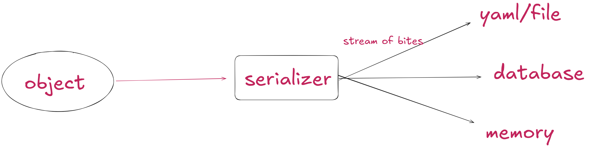

yaml => yaml aint markup language
it is basically a data format used to exchange data.

similar to xml and json
in yaml, you can store only data, and not commands

## data serialisation

reverse of this image is called deserialisation, part of ml

- data serialisation language: yaml, json, xml
- configuration files -> DOCKER/KUBERNETES etc
used to manage logs, caches, etc

## benifits of yaml

- simple and easy to read
- it has a strict syntax- identation is important
- more powerful when representing complex data
- parser etc. various tools available